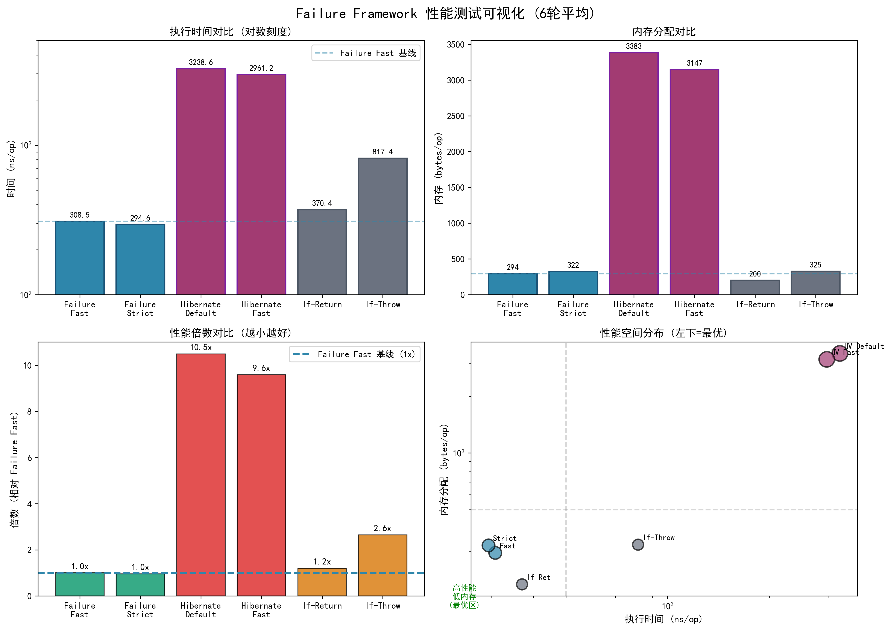

# Failure Spring Boot Starter

[](https://github.com/KyrieChao/Failure/actions/workflows/ci.yml)
[](https://codecov.io/gh/KyrieChao/Failure)
[](LICENSE)
[](https://www.oracle.com/java/technologies/downloads/)
[](https://spring.io/projects/spring-boot)
[](https://central.sonatype.com/artifact/io.github.kyriechao/failure-spring-boot-starter)
[](https://jitpack.io/#KyrieChao/Failure)
[](https://ifdian.net/a/chao242702)
[](https://github.com/KyrieChao/Failure/commits/main)
[](https://github.com/KyrieChao/Failure/stargazers)


[中文版本](./README.md)

Failure is a lightweight, high-performance validation and business-exception framework designed for Spring Boot 3.x.
Following the "Fail Fast, Fail Strict" philosophy, it eliminates boilerplate code and provides a type-strict, fluent
validation experience.

🔗 **Live Demo**: [Failure-in-Action](https://github.com/KyrieChao/Failure-in-Action)

---

## 🚀 Core Features

- **Fluent Validation Chain**: Supports `Fail-Fast` (immediate fail) and `Fail-Strict` (collect all errors) modes.
- **Rich Assertions**: Built-in 50+ validation methods for Objects, Strings, Numbers, Collections, Date/Time, Enums, Optionals, etc.
- **Default Localization**: Provides out-of-the-box localized error messages (e.g., Chinese support) without manual configuration.
- **Annotation-Driven & Type Dispatch**: Provides `@Validate` annotation and `FastValidator` interface for AOP validation; supports `TypedValidator` pattern for automatic type dispatch and decoupling.
- **Functional Results**: Provides `Result<T>` monad with `map`, `flatMap`, `recover` operations.
- **Smart Debug Snapshot**: Optionally includes invalid values in exceptions (auto-masking & truncation) when `fail-fast.debug-snapshot=true` (default: false).
- **Smart Exception Handling**: Automatically maps business error codes to HTTP status codes, with `shadow-trace` for quick debugging.

---

## ⚡ 30-Second Comparison

**No More Boilerplate, Just Fluent Flow**

<table>
<tr>
<th width="50%">Traditional "if-throw" Hell</th>
<th width="50%">Failure "Fluent" Style</th>
</tr>
<tr>
<td>

```java
if(user ==null){
    throw new BusinessException(Code.USER_NULL);
}
if(StringUtils.isBlank(user.getName())){
    throw new BusinessException(Code.NAME_EMPTY);
}
if(user.getAge() < 18){
    throw new BusinessException(Code.TOO_YOUNG);
}
```

</td>
<td>

```java
Failure.begin()
    .notNull(user, Code.USER_NULL)
    .notBlank(user.getName(),Code.NAME_EMPTY)
    .min(user.getAge(), 18,Code.TOO_YOUNG)
    .fail();
```

</td>
</tr>
</table>

---

---
## ⚡ Performance

JMH microbenchmark results (vs Hibernate Validator):



*Test environment & reproducible code: [Benchmark repo](https://github.com/KyrieChao/Benchmark)*

---

## 📚 Documentation

| Document                                  | Content                                                 |
|:------------------------------------------|:--------------------------------------------------------|
| [Quick Start](#%EF%B8%8F-quick-start)     | Installation, basic usage, and three modes introduction |
| [API Reference](docs/API_REFERENCE.en.md)    | Complete API list, method details, and best practices   |
| [Configuration](#%EF%B8%8F-configuration) | application.yml configuration details                   |
| [I18n Guide](./docs/I18N_GUIDE.md)        | Internationalization configuration and key reference    |
| [Response Code Management](./docs/RESPONSE_CODE_MANAGEMENT.md) | Response code mapping and management scheme |

---

## 🛠️ Quick Start

### 1. Requirements

- JDK 17+
- Spring Boot 3.2.x+

### 2. Dependency

This project is published on Maven Central. Add the dependency to your `pom.xml`:

```xml
<!-- Maven Central (Recommended for Production) -->
<dependency>
    <groupId>io.github.kyriechao</groupId>
    <artifactId>failure-spring-boot-starter</artifactId>
    <version>1.0.2</version> <!-- Make sure it's up to date. -->
</dependency>
```

---

## 💡 Three Validation Modes

### Mode 1: Fail-Fast (Immediate Failure)

**Scenario**: Defensive programming for parameters. Stops subsequent logic immediately upon finding an invalid
parameter.

```java
// Throws exception immediately if notBlank fails, subsequent checks will not be executed
Failure.begin()
    .notBlank(username, UserCode.USERNAME_REQUIRED)
    .email(email, UserCode.EMAIL_INVALID)
    .fail();
```

**Terminal Methods**:

| Method                    | Description                                                                           |
|:--------------------------|:--------------------------------------------------------------------------------------|
| `.fail()`                 | Standard terminal method, throws the first exception if errors exist                  |
| `.failNow(code, message)` | **Force Immediate Failure**, throws specified exception regardless of previous checks |

```java
// Force fail example: Permission check
Failure.begin()
    .notNull(user, UserCode.USER_NOT_FOUND)
    .failNow(UserCode.PERMISSION_DENIED, "Access Denied")  // Throws immediately
    .state(user.getRole() ==Role.ADMIN,UserCode.PERMISSION_DENIED)  // Will not execute
    .fail();
```

---

### Mode 2: Fail-Strict (Collect All)

**Scenario**: Form submission, batch import, etc., where all errors need to be returned at once.

```java
// All validations are executed, errors are collected and thrown together
Failure.strict()
    .notBlank(username, UserCode.USERNAME_REQUIRED, "Username cannot be empty")
    .email(email, UserCode.EMAIL_INVALID, "Invalid email format")
    .min(age, 18,UserCode.AGE_TOO_YOUNG, "Must be at least 18 years old")
    .failAll();  // Must use failAll()
```

**Manual Error Retrieval (No Exception)**:

```java
var chain = Failure.strict()
        .notBlank(username, UserCode.USERNAME_REQUIRED)
        .email(email, UserCode.EMAIL_INVALID);

if(!chain.isValid()){
var causes = chain.getCauses();  // Get all errors
    return Result.fail("Validation failed",causes);
}
```

---

### Mode 3: Contextual (Context Integration)

**Scenario**: Used with `@Validate` annotation to decouple validation logic from business code.

```java
// Controller
@PostMapping("/register")
@Validate(value = UserRegisterValidator.class, fast = false)  // fast=false collects all errors
public Result<?> register(@RequestBody UserRegisterDTO dto) {
    userService.register(dto);
    return Result.success("Registration successful");
}

// Validator
@Component
public class UserRegisterValidator implements FastValidator<UserRegisterDTO> {
    @Override
    public void validate(UserRegisterDTO dto, ValidationContext ctx) {
        Failure.with(ctx)
                .notBlank(dto.getUsername(), UserCode.USERNAME_REQUIRED)
                .email(dto.getEmail(), UserCode.EMAIL_INVALID)
                .verify();  // Contextual mode uses verify()
    }

    @Override
    public Class<?> getSupportedType() {
        return UserRegisterDTO.class;
    }
}
```

**@Validate fast parameter**:

| fast Value       | Behavior                            | Scenario             |
|:-----------------|:------------------------------------|:---------------------|
| `true` (Default) | Stops immediately after first error | Performance priority |
| `false`          | Executes all validation rules       | Show all errors      |

---

### 4.4 Exception Handling & JSR-303 Compatibility

The framework provides built-in `FailFastExceptionHandler`, which not only handles its own business exceptions but also
perfectly integrates with Spring's native JSR-303 (`@Valid` / `@Validated`) validation.

**Features**:

- **Unified Format**: Whether it is an exception thrown by `Failure` or triggered by `@NotNull`, the final response
  format is completely consistent.
- **Mode Adaptation**: The `fast` attribute of the `@Validate` annotation also applies to JSR-303 exceptions.
    - `fast=true` (Default): Even if Hibernate Validator throws multiple errors, only the first one is returned in the
      response.
    - `fast=false`: Returns all errors collected by JSR-303.

To customize, inherit `FailFastExceptionHandler`:

```java

@RestControllerAdvice
public class CustomExceptionHandler extends FailFastExceptionHandler {

    @Override
    @ExceptionHandler(Business.class)
    public ResponseEntity<?> handleBusinessException(Business e) {
        // Custom response format
        Map<String, Object> body = new HashMap<>();
        body.put("success", false);
        body.put("errorCode", e.getResponseCode().getCode());
        body.put("errorMessage", e.getResponseCode().getMessage());
        body.put("detail", e.getDetail());
        return ResponseEntity.badRequest().body(body);
    }
}
```

---

## 🎛️ Flow Control & Lazy Evaluation

### Dynamic Skip (when)

Control whether to execute subsequent validations dynamically.

```java
Failure.begin()
    .when(isVip)                // If not VIP
    .check(vipRule)             // This line will be skipped
    .when(true)                 // Resume execution
    .check(commonRule);         // Continue execution
```

### Lazy Evaluation (defer)

Execute expensive validation logic (via Supplier) only when strictly necessary. If previous validations failed (
Fail-Fast) or were skipped, the supplier will not be executed.

```java
Failure.begin()
    .notNull(userId)// Query DB only if userId is not null
    .defer(() ->dbService
    .isUserActive(userId),UserCode.USER_INACTIVE);
```

### Lazy invalidValue snapshot (Supplier)

When the invalid value snapshot is expensive (e.g., serialization / masking), use the Supplier overload so it is computed only on failure and only when debug snapshot is enabled.

```java
Failure.begin()
    .check(user != null, UserCode.USER_NULL, "User required", () -> user)
    .fail();
```

### Stop on Failure (stopOnFail)

Stops subsequent checks if there are any errors (even in strict mode), until `resume()` is called. Essential for
preventing NPE.

```java
Failure.strict()
    .notNull(user, UserCode.REQUIRED)
    .stopOnFail()      // Stop if user is null
    .defer(() ->user.isAdmin(),UserCode.NO_PERMISSION); // Safe access
```

---

## 🔀 Logical Operations (OR)

The `or()` operator is supported for "Condition A OR Condition B" scenarios.

```java
// Example: User is either ADMIN OR has READ permission
Failure.begin()
    .equals(role, Role.ADMIN)       // Condition A: Is Admin
    .or()                           // OR
    .hasPermission(user, "READ")    // Condition B: Has Read Permission
    .failNow(UserCode.NO_PERMISSION); // Throws if neither A nor B is satisfied
```

Note: `or()` only applies to the immediately adjacent conditions. The default logic for chain calls is `AND`.
`A.or().B.C` is equivalent to `(A || B) && C`.

---

## ⚙️ Configuration

Configure framework behavior in `application.yml`:

```yaml
fail-fast:
  shadow-trace: true   # Include class name and line number of the validation point in exception stack trace
  debug-snapshot: true # Enable debug snapshot to include invalid values (default: false)
  verbose: true        # Include detailed errors list in multi-error response
  code-mapping:
    http-status:
      40001: 400       # Error Code 40001 -> HTTP 400
      40100: 401
    groups:
      auth: [ "40100..40199" ]      # Range mapping
      business: [ "40000..40099" ]
```

### Custom default rules (ErrorPolicy)

For advanced customization of default response code, default detail generation, and whether to capture invalid values, provide an `ErrorPolicy` Spring bean.

---

## 📖 More Documentation

- **[API_REFERENCE.en.md](docs/API_REFERENCE.en.md)** - Complete API Reference, Design Patterns
- **[Failure-in-Action](https://github.com/KyrieChao/Failure-in-Action)** - Live Demo Project

---
## ☕ Support the Author

If you find this project helpful, consider [supporting me on Aifadian](https://ifdian.net/a/chao242702) to help maintain Failure.

Or simply give it a ⭐ Star to help more people discover this project!

---
## 🤝 Contributing

Issues and Pull Requests are welcome! Please run `mvn test` before submitting and follow the existing code style.

## 📄 License

Apache License 2.0 - See [LICENSE](LICENSE) for details.

---
**Author**: [KyrieChao](https://github.com/KyrieChao)
