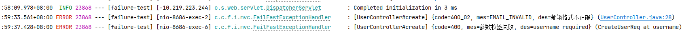

# Failure Spring Boot Starter

[](https://github.com/KyrieChao/Failure/actions/workflows/ci.yml)
[](https://codecov.io/gh/KyrieChao/Failure)
[](LICENSE)
[](https://www.oracle.com/java/technologies/downloads/)
[](https://spring.io/projects/spring-boot)
[](https://central.sonatype.com/artifact/io.github.kyriechao/failure-spring-boot-starter)
[](https://jitpack.io/#KyrieChao/Failure)
[](https://ifdian.net/a/chao242702)
[](https://github.com/KyrieChao/Failure/commits/main)
[](https://github.com/KyrieChao/Failure/stargazers)
[](https://scorecard.dev/viewer/?uri=github.com/KyrieChao/Failure)

[English Version](./README.en.md)

Failure 是一个专为 Spring Boot 3.x 设计的轻量级、高性能参数校验与业务异常处理框架。它遵循 "Fail Fast, Fail Strict" 设计哲学，旨在消除样板代码，提供类型安全、流式调用的校验体验。

🔗 **实战示例项目**: [Failure-in-Action](https://github.com/KyrieChao/Failure-in-Action)

🌐 **Failure 框架指南**: [KyrieChao Blogs](https://kyriechao.github.io)

📊 **完整性能报告与测试代码**：[Failure-Benchmark](https://github.com/KyrieChao/Benchmark)

---

## ⚡ 快速了解

- 你写：`Failure.begin().notBlank(...).email(...).fail();`
- 你得到：统一的错误响应 JSON（含 code/message/description/errors/timestamp），并自动兼容 Spring 的 `@Valid`/`@Validated`
- 你不需要：在每个方法里重复 `if (...) ...` 校验 

## 🚀 快速接入（MVC 最小例子）

### 1) 引入依赖

```xml
<dependency>
    <groupId>io.github.kyriechao</groupId>
    <artifactId>failure-spring-boot-starter</artifactId>
    <version>latest</version> <!-- 请使用最新版本 -->
</dependency>
```

### 2) 写一个最小 Controller

```java
import com.chao.failure.Failure;
import com.chao.failure.internal.core.ResponseCode;
import jakarta.validation.Valid;
import jakarta.validation.constraints.NotBlank;
import org.springframework.web.bind.annotation.*;

@RestController
@RequestMapping("/users")
public class UserController {

    public interface UserCode {
        ResponseCode USERNAME_REQUIRED = ResponseCode.of(40001, "USERNAME_REQUIRED", "用户名不能为空");
        ResponseCode EMAIL_INVALID = ResponseCode.of(40002, "EMAIL_INVALID", "邮箱格式不正确");
    }

    public record CreateUserReq(@NotBlank(message = "username required")String username,String email) {}

    @PostMapping
    public String create(@RequestBody @Valid CreateUserReq req) {
        Failure.begin()
                .notBlank(req.username(), UserCode.USERNAME_REQUIRED)
                .email(req.email(), UserCode.EMAIL_INVALID)
                .fail();
        return "ok";
    }
}
```
#### 配置 application.yml
```yaml
fail-fast:
  shadow-trace: true
```

### 3) 看看出错时返回长什么样

```json
{
  "code": 400,
  "description": "username required",
  "message": "参数校验失败",
  "timestamp": "2026-04-28 20:00:14"
}
```
```json
{
  "code": 40002,
  "description": "邮箱格式不正确",
  "message": "EMAIL_INVALID",
  "timestamp": "2026-04-28 20:00:44"
}
```


## 🚀 核心特性

- **流式校验链**：支持 `Fail-Fast`（快速失败）与 `Fail-Strict`（全量收集）双模式；链式 API 可组合校验并支持终结操作（抛首个 / 聚合抛出 / 仅验证不抛出）
- **丰富的断言库**：内置对象、字符串、数值、集合、日期时间、枚举、Optional 等 50+ 种校验方法
- **默认本地化**：提供开箱即用的中文错误提示（如“当前值不能为空”），默认 `zh_CN`，可扩展自定义 i18n 文案
- **注解驱动与类型分发**：提供 @Validate + AOP 执行自定义 **FastValidator** ；支持两种分发方式： **TypedValidator** 用注册表对多类型参数按运行时类型路由； **TemplateValidator<T>** 通过解析泛型实参自动确定支持类型，便于多层继承复用校验逻辑并减少样板代码
- **函数式结果**：提供 `Result<T>` 单子类型，支持 `map` / `flatMap` / `recover` 等函数式组合
- **智能调试快照**：当 `fail-fast.debug-snapshot=true`（默认 false）时，异常信息可包含失败参数值（自动脱敏与截断），让报错即线索
- **异常映射与响应**：自动映射业务错误码到 HTTP 状态码；提供统一错误响应结构（含 traceId/spanId），并在 `fail-fast.verbose=true` 时附带 `errors` 明细（默认不返回）；当上下文缺失时，`4xxxx` 错误码稳定回退为 `400`（避免误回 `500`）
- **影子追踪**：当 `fail-fast.shadow-trace=true` 时，异常会携带调用方法/位置等定位信息，便于快速排查
- **路径与递归校验增强**：支持通过 `at(path)` 绑定失败路径与失败值快照；提供对象图递归遍历与可配置的递归选项（深度/集合限制/循环引用处理）
- **事件驱动与可取消校验**：提供校验事件监听（start/end/failure/violation）与可取消令牌（CancelToken），并支持进度监听（ProgressListener）
- **脱敏与安全增强**：结构化递归脱敏能力与层级/集合/字段限制；新增校验器白名单注册表（ValidatorWhitelistRegistry）以收敛反射实例化风险
- **可观测性与 WebFlux 上下文**：OpenTelemetry trace/span 提取与 WebFlux Reactor Context 优先读取（`fail-fast.reactive.context-first`）
---

## ⚡ 快速对比

**拒绝样板代码，拥抱流畅体验**

<table>
<tr>
<th width="50%">传统 "if-throw"</th>
<th width="50%">Failure "Fluent" 风格</th>
</tr>
<tr>
<td>

```java
if (user == null) {
    throw Business.of(Code.USER_NULL);
}
if (StringUtils.isBlank(user.getName())) {
    throw Business.of(Code.NAME_EMPTY);
}
if (user.getAge() < 18) {
    throw Business.of(Code.TOO_YOUNG);
}
```

</td>
<td>

```java
Failure.begin()
    .notNull(user, Code.USER_NULL)
    .notBlank(user.getName(), Code.NAME_EMPTY)
    .min(user.getAge(), 18, Code.TOO_YOUNG)
    .fail();
```

</td>
</tr>
</table>

---

## 📚 文档导航

| 文档                         | 内容                            |
|----------------------------| ----------------------------------- |
| [快速开始](#-快速开始)             | 安装、基础用法、三种模式入门   |
| [API 参考](docs/API_REFERENCE.md) | 完整的 API 列表、方法详解、最佳实践 |
| [配置说明](#%EF%B8%8F-配置说明)    | application.yml 配置项详解  |
| [国际化指南](./docs/I18N_GUIDE.md) | 国际化配置及键值参考 |
| [响应码管理](./docs/RESPONSE_CODE_MANAGEMENT.md) | 响应码对应关系及管理方案 |
| [兼容性矩阵](docs/COMPATIBILITY_MATRIX.md) | 支持的 Java / Spring Boot 版本 |
| [迁移指南](docs/MIGRATION_GUIDE.md) | 升级建议与 breaking change |
| [生产检查清单](docs/PRODUCTION_CHECKLIST.md) | 上生产前建议项 |
| [FAQ](docs/FAQ.md) | 常见问题（含与 @Valid 关系） |
---

## 🛠️ 快速开始

### 环境要求

- JDK 17+
- Spring Boot 3.2.x+

### 引入依赖

本项目已发布至 Maven Central，请在 `pom.xml` 中直接添加依赖：

```xml
<!-- Maven Central -->
<dependency>
    <groupId>io.github.kyriechao</groupId>
    <artifactId>failure-spring-boot-starter</artifactId>
    <version>latest</version> <!-- 请使用最新版本 -->
</dependency>
```
本项目已发布至 JitPack：
```xml
<dependency>
    <groupId>com.github.KyrieChao</groupId>
    <artifactId>failure-spring-boot-starter</artifactId>
    <version>latest</version> <!-- 请使用最新版本 -->
</dependency>
```


| 渠道 | 说明 |
|------|------|
| Maven Central | ✅ 稳定版 |
| JitPack | ⚡ 开发版，包含最新提交 |

### 可选 Starter（Observability / OpenAPI）

Failure 采用“核心 starter + 可选生态 starter”的结构：核心 starter 不强依赖 Micrometer/springdoc，可选模块按需引入。

**Observability / OpenAPI 模块独立迭代说明**
- `Observability` 与 `OpenAPI` 模块已改为独立迭代，发版节奏不再与核心 Failure 模块绑定。
- 这两个模块将按自身功能需求和修复进度独立发布版本，无需与核心模块保持版本同步。
- 如有功能需求或问题，欢迎在 **GitHub Issues** 提出。

#### 1) Observability（Micrometer）

当应用中存在 `MeterRegistry` 时自动生效，产生指标：
- `failure.validation.time`（Timer，tag：`source=chain|jsr|method`）
- `failure.validation.count`（Counter，tag：`source=chain|jsr|method`、`result=success|fail`）

```xml
<dependency>
    <groupId>io.github.kyriechao</groupId>
    <artifactId>failure-observability-spring-boot-starter</artifactId>
    <version>latest</version>
</dependency>
```

#### 2) OpenAPI（springdoc）

当应用中存在 springdoc 的 `OpenAPI` 类型时自动生效：
- 注入统一的错误响应 Schema（`ErrorItem` / `ErrorResponse`）
- 为所有接口补充 `400` / `422` 错误响应（若未定义）

```xml
<dependency>
    <groupId>io.github.kyriechao</groupId>
    <artifactId>failure-openapi-springdoc-starter</artifactId>
    <version>latest</version>
</dependency>
```

---

## 💡 三种校验模式

### 模式一：Fail-Fast（快速失败）

**适用场景**: 参数防御性编程，一旦发现非法参数立即停止后续逻辑。

```java
// 一旦 notBlank 失败，立即抛出异常，不会执行后续校验
Failure.begin()
    .notBlank(username, UserCode.USERNAME_REQUIRED)
    .email(email, UserCode.EMAIL_INVALID)
    .fail();
```
```java
Failure.begin()
    .notBlank(username)
    .notNull(email)
    .failNow(UserCode.REQUIRED)
    .phone(phone)
    .email(email)
    .failNow(UserCode.INVALID);
```


**终结方法对比**:

| 方法                      | 说明                 |
| ------------------------- |--------------------|
| `.fail()`                 | 标准终结方法，有错误时抛出第一个异常 |
| `.failNow(code, message)` | 多数时候用于**分组校验**不用重写错误码 |

```java
// 强制失败示例：权限检查
Failure.begin()
    .notNull(user, UserCode.USER_NOT_FOUND)
    .failNow(UserCode.PERMISSION_DENIED, "当前角色无权访问")  // 直接抛出，后续不执行
    .state(user.getRole() == Role.ADMIN, UserCode.PERMISSION_DENIED)  // 不会执行
    .fail();
```

---

### 模式二：Fail-Strict（全量收集）

**适用场景**: 表单提交、批量导入等需要一次性返回所有错误的场景。

```java
// 所有校验都会执行，最终收集所有错误统一抛出
Failure.strict()
    .notBlank(username, UserCode.USERNAME_REQUIRED, "用户名不能为空")
    .email(email, UserCode.EMAIL_INVALID, "邮箱格式不正确")
    .min(age, 18, UserCode.AGE_TOO_YOUNG, "年龄必须 ≥ 18 岁")
    .failAll();  // 必须配合 failAll() 使用
```

**手动获取错误（不抛异常）**:

```java
var chain = Failure.strict()
    .notBlank(username, UserCode.USERNAME_REQUIRED)
    .email(email, UserCode.EMAIL_INVALID);

if (!chain.isValid()) {
    var causes = chain.getCauses();  // 获取所有错误
    return Result.fail("参数校验失败", causes);
}
```

---

### 模式三：Contextual（上下文集成）

**适用场景**: 结合 `@Validate` 注解，将校验逻辑从业务代码中解耦。

```java
// Controller
@PostMapping("/register")
@Validate(value = UserRegisterValidator.class, fast = false)  // fast=false 全量收集
public Result<?> register(@RequestBody @Valid UserRegisterDTO dto) {
    userService.register(dto);
    return Result.ok("注册成功");
}

// Validator
@Component
public class UserRegisterValidator implements FastValidator<UserRegisterDTO> {
    @Override
    public void validate(UserRegisterDTO dto, ValidationContext ctx) {
        Failure.with(ctx)
            .notBlank(dto.getUsername(), UserCode.USERNAME_REQUIRED)
            .email(dto.getEmail(), UserCode.EMAIL_INVALID)
            .verify();  // Contextual 模式使用 verify() 终结
    }

    @Override
    public Class<?> getSupportedType() {
        return UserRegisterDTO.class;
    }
}
```

**@Validate 的 fast 参数**:

| fast 值       | 行为                 | 适用场景         |
| ------------- | -------------------- | ---------------- |
| `true` (默认) | 第一个错误后立即停止 | 性能优先         |
| `false`       | 执行所有校验规则     | 需要展示所有错误 |

---


### 4.4 异常处理与 JSR-303 兼容

框架内置了 `FailFastExceptionHandler`，不仅处理自身的业务异常，还完美兼容 Spring 原生的 JSR-303 (`@Valid` / `@Validated`) 校验。

**特性**:
- **统一格式**: 无论是 `Failure` 抛出的异常，还是 `@NotNull` 触发的异常，最终响应格式完全一致。
- **模式适配**: `@Validate` 注解的 `fast` 属性同样适用于 JSR-303 异常。
  - `fast=true` (默认): 即使 Hibernate Validator 抛出了多个错误，响应中也只返回第一个。
  - `fast=false`: 完整返回 JSR-303 收集到的所有错误。

如需自定义，可继承 `FailFastExceptionHandler`：

```java
@RestControllerAdvice
public class CustomExceptionHandler extends FailFastExceptionHandler {

    @Override
    @ExceptionHandler(Business.class)
    public ResponseEntity<?> handleBusinessException(Business e) {
        // 自定义响应格式
        Map<String, Object> body = new HashMap<>();
        body.put("success", false);
        body.put("errorCode", e.getResponseCode().getCode());
        body.put("errorMessage", e.getResponseCode().getMessage());
        body.put("detail", e.getDetail());
        return ResponseEntity.badRequest().body(body);
    }
}
```

---

## 🎛️ 流程控制与延迟校验

### 动态跳过 (when)

根据条件动态决定是否执行后续的校验逻辑。

```java
Failure.begin()
    .when(isVip)                // 如果不是 VIP
    .check(vipRule)             // 这一行会被跳过
    .when(true)                 // 恢复执行
    .check(commonRule);         // 继续执行
```

### 延迟校验 (defer)

仅在真正需要时才执行开销较大的校验逻辑（支持 Supplier）。如果前面的校验已经失败（Fail-Fast）或被跳过，则不会执行。

```java
Failure.begin()
    .notNull(userId)
    // 只有 userId 不为 null 时，才会执行数据库查询
    .defer(() -> dbService.isUserActive(userId), UserCode.USER_INACTIVE);
```

### 延迟 invalidValue 快照（Supplier）

当失败值快照生成开销较大（序列化/脱敏/拼接）时，可用 Supplier 版本：仅在失败且启用 debug-snapshot 时才计算。

```java
Failure.begin()
      .check(user != null, UserCode.USER_NOT_FOUND, "用户不能为空", () -> user)
      .fail();
```
或者
```java
Failure.begin()
      .at(Masker.Password.type(),user::getPassword)
      .equals(user.getPassword(), "123456", UserCode.INVALID)
      .fail();
```

### 失败截断 (stopOnFail)

如果当前链中存在错误（即使是 strict 模式），则停止后续所有校验（直到调用 `resume()`）。通常用于防止空指针异常（NPE）。

```java
Failure.strict()
    .notNull(user, UserCode.REQUIRED)
    .stopOnFail()                   // 如果 user 为空，停止后续校验
    .defer(() -> user.isAdmin(), UserCode.NO_PERMISSION); // 安全访问
```

---

## 🔀 逻辑运算 (OR)

支持 `or()` 逻辑操作符，用于表达 "满足条件A 或 满足条件B" 的场景。

```java
// 示例：用户或者是管理员，或者是拥有特定权限的普通用户
Failure.begin()
    .equals(role, Role.ADMIN)       // 条件A：是管理员
    .or()                           // 或
    .hasPermission(user, "READ")    // 条件B：拥有读权限
    .failNow(UserCode.NO_PERMISSION); // 如果A和B都不满足，则抛出异常
```

注意：`or()` 仅作用于其紧邻的两个条件。链式调用的默认逻辑为 `AND`。
`A.or().B.C` 等价于 `(A || B) && C`。

---

## ⚙️ 配置说明

在 `application.yml` 中配置（完整配置项列表见 [CONFIGURATION.md](docs/CONFIGURATION.md)）：

```yaml
fail-fast:
  shadow-trace: true
  trim-stack-trace: true
  verbose: true
  debug-snapshot: true
  method-validation-enabled: true
  trace-id:
    enabled: true
    header-name: X-Trace-Id
    response-header-name: X-Trace-Id
    response-header: true
    generate-if-missing: true
    mdc-key: traceId
    mdc-enabled: true
  code-mapping:
    constraint-mapping:
      NotBlank: 40010
      Email: 40020
      Positive: 40030
    constraint-path-mapping:
      - constraint: NotBlank
        path: user.username
        code: 40040
      - constraint: NotNull
        path: user.username
        code: 40045
      - constraint: Email
        path: user.email
        code: 40050
    constraint-bean-mapping:
      - constraint: NotBlank
        bean: com.chao.failuretest.model.dto.UserJSRDTO
        code: 40060
      - constraint: Email
        bean: com.chao.failuretest.model.dto.UserDTO
        code: 40070
    http-status:
      40010: 400
    groups:
      auth: ["40100..40199"]
      business: ["40000..40099"]
  i18n:
    default-locale: zh_CN
  logging:
    banner: false
  masking:
    structured-enabled: true
    max-depth: 4
    max-collection-size: 20
    max-fields: 30
```

### WebFlux Context-First（推荐）

在 WebFlux（Reactive）模型下，线程会切换，ThreadLocal 可能出现上下文丢失。开启 `fail-fast.reactive.context-first=true` 后，框架内部关键决策（如 `shadow-trace`、`scene`、`traceId`）会优先从 Reactor Context 读取，再回退到 ThreadLocal，从而更稳定。

---

## 📖 更多文档

- **[API_REFERENCE.md](docs/API_REFERENCE.md)** - 完整的 API 参考、所有校验方法列表、设计模式详解
- **[CONFIGURATION.md](docs/CONFIGURATION.md)** - 配置项说明
- **[Failure-in-Action](https://github.com/KyrieChao/Failure-in-Action)** - 实战示例项目

---

## ☕ 支持作者

如果这个项目对你有帮助，可以考虑[在爱发电支持我](https://ifdian.net/a/chao242702)，用于持续维护 Failure

或者简单地给我一个 ⭐ Star，让更多人发现这个项目！

---
## 🤝 贡献指南

欢迎提交 Issue 或 Pull Request！请确保：

- 运行 `mvn test` 通过所有测试
- 代码覆盖率遵守 JaCoCo 阈值（默认 80%+）
- 遵循现有代码风格

## 📄 许可证

Apache License 2.0 - 详见 [LICENSE](LICENSE) 文件。

---

**Author**: [KyrieChao](https://github.com/KyrieChao)
